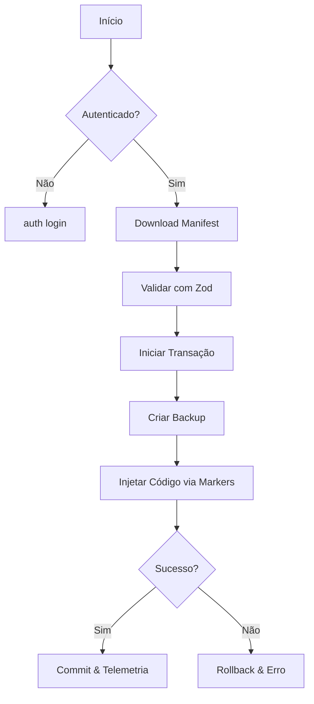

# Kaven CLI v2

A **Kaven CLI v2** é a espinha dorsal da experiência de desenvolvimento no ecossistema Kaven. Ela foi projetada para garantir que a instalação e remoção de módulos sejam operações seguras, previsíveis e totalmente auditáveis.

## Visão Geral

Diferente de CLIs tradicionais que apenas copiam arquivos, a Kaven CLI implementa um sistema de **Injeção Baseada em Markers** e um **FileSystem Transacional**. Isso permite que o código seja injetado em arquivos existentes (como `main.ts` ou `routes.ts`) sem risco de corrupção ou duplicação.

## Arquitetura Core

A CLI é construída sobre quatro pilares fundamentais:

### 1. Sistema de Markers (Idempotência)

Cada injeção de código é envolvida por blocos de comentários únicos:

```typescript
// [KAVEN_MODULE:payments BEGIN]
app.use("/payments", paymentsRouter);
// [KAVEN_MODULE:payments END]
```

O `MarkerService` garante que:

- O código não seja injetado duas vezes (idempotência).
- A remoção seja limpa, sem deixar resíduos nos arquivos do projeto.

### 2. FileSystem Transacional

Toda operação que modifica o disco é executada dentro de uma transação.

- **Backup**: Antes de qualquer mudança, os arquivos originais são copiados para `.agent/backups/`.
- **Commit**: Se todas as injeções tiverem sucesso, o backup é removido.
- **Rollback**: Se qualquer etapa falhar (ex: âncora não encontrada, erro de permissão), a CLI restaura automaticamente o estado original.

### 3. Manifest Parser (Next-Gen)

Utilizamos **Zod** para validar o `module.json`. Isso garante que apenas módulos com estrutura correta e dependências compatíveis sejam processados.

### 4. Coleta de Telemetria

Cada comando executado alimenta um buffer local que registra:

- Duração das operações.
- Logs de sucesso e erro.
- Metadados de uso (sem dados sensíveis).

## Comandos Principais

### Gerenciamento de Módulos

- `kaven module add <path>`: Adiciona um módulo local.
- `kaven module remove <name>`: Remove e limpa o código injetado.
- `kaven module doctor`: Executa um checklist de saúde no projeto.

### Marketplace

- `kaven marketplace list`: Lista módulos disponíveis na nuvem.
- `kaven marketplace install <id>`: Autentica, baixa e instala de forma atômica.

### Observabilidade

- `kaven telemetry view`: Audita os últimos eventos de telemetria locais.

## Fluxo de Instalação (E2E)



## Configurações e Logs

- **Auth**: `~/.kaven/auth.json` (Protegido com permissão 0600)
- **Telemetry**: `~/.kaven/telemetry.log`
- **Backups**: `.agent/backups/` (Local do projeto)
