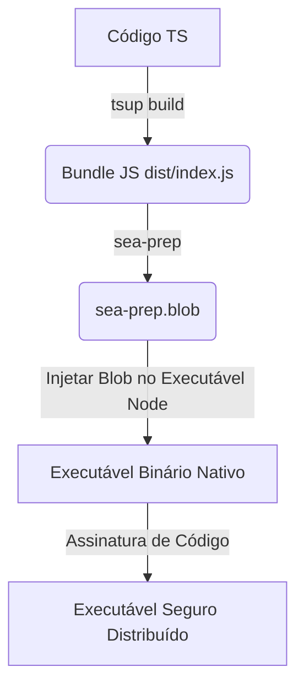

# DevSecOps — Recomendações de Segurança no Processo de Compilação

Este documento apresenta a análise de DevSecOps realizada sobre o processo de build do `kaven-cli` e detalha as propostas para mitigar vulnerabilidades e elevar a segurança na compilação e distribuição do executável.

---

## 1. Contexto Atual
Atualmente, o `kaven-cli` utiliza o `tsup` para gerar um bundle compilado e minificado em formato ESM (`dist/index.js`). Este arquivo é executado diretamente na máquina do cliente utilizando o interpretador Node.js global do sistema host.

A análise aponta duas oportunidades críticas de melhoria na segurança da cadeia de distribuição:
1. **Falta de controle de runtime:** A CLI fica exposta a vulnerabilidades de versões desatualizadas do Node.js instaladas nos clientes.
2. **Facilidade de adulteração:** Como o JavaScript reside em texto claro no `node_modules` local, ele é vulnerável a alterações maliciosas de terceiros ou spywares no host do cliente para interceptar segredos.

---

## 2. Recomendações de Segurança

### 2.1) Empacotamento Binário Nativo (Node.js SEA)
Recomenda-se a compilação do bundle `dist/index.js` em um binário nativo autoexecutável utilizando o **Single Executable Applications (SEA)**, um recurso nativo do Node.js 20+.



#### Como Funciona:
1. **Preparação do Blob:** Gera-se um arquivo de configuração JSON apontando para o bundle `dist/index.js` e executa-se o comando para criar um blob preparado:
   ```bash
   node --experimental-sea-config sea-config.json
   ```
2. **Injeção do Blob:** Uma cópia do binário do Node.js é modificada injetando o blob criado no segmento de recursos do executável:
   - *No Linux/macOS:* Usando a ferramenta `postject`.
   - *No Windows:* Usando recursos do PE.

**Resultado:** O usuário baixa apenas um binário (`kaven`), que roda sob uma versão isolada e segura do Node.js sem necessidade de instalação do runtime global.

---

### 2.2) Provenance e Integridade na Publicação (NPM Provenance)
Para evitar ataques de sequestro de credenciais de publicação (onde contas de mantenedores são comprometidas), a publicação do CLI deve ser feita estritamente via pipeline do GitHub Actions utilizando assinaturas de proveniência de build.

#### Configuração Recomendada:
Adicionar o suporte a atestados OIDC no arquivo de workflow do GitHub Actions:

```yaml
permissions:
  id-token: write # Necessário para assinar a proveniência
  contents: read

jobs:
  publish:
    runs-on: ubuntu-latest
    steps:
      - uses: actions/checkout@v4
      - uses: pnpm/action-setup@v3
      - uses: actions/setup-node@v4
        with:
          node-version: 20
          registry-url: 'https://registry.npmjs.org'
      - run: pnpm install --frozen-lockfile
      - run: pnpm run build
      - run: npm publish --provenance
        env:
          NODE_AUTH_TOKEN: ${{ secrets.NPM_TOKEN }}
```

**Resultado:** O npm gera um selo público de proveniência na página do pacote, atestando criptograficamente que o binário publicado foi compilado diretamente a partir deste repositório GitHub de forma imutável.

---

### 2.3) Imutabilidade de Dependências e Segurança de Scripts de Terceiros
Durante o processo de compilação em servidores de CI/CD:
1. **Forçar Lockfile:** Sempre use `--frozen-lockfile` para bloquear qualquer resolução dinâmica de pacotes na internet.
2. **Desativar Scripts pós-instalação:** Desative scripts automáticos em dependências que não foram pré-aprovadas para barrar a execução de binários invasores:
   ```bash
   pnpm install --frozen-lockfile --ignore-scripts
   ```

---

### 2.4) Varredura Contínua (SAST/DAST/Secret Scanning)
1. **Secret Scanning:** Integrar o **Gitleaks** ou **TruffleHog** como etapa do pre-commit local e do CI para impedir o commit acidental de chaves de teste ou endpoints internos.
2. **Compilação sem Variáveis Hardcoded:** Utilizar a opção `define` do `tsup` para injetar variáveis em tempo de build, evitando chaves permanentes no código-fonte.
   - *Exemplo no tsup.config.ts:*
     ```typescript
     import { defineConfig } from 'tsup';
     export default defineConfig({
       define: {
         'process.env.KAVEN_API_URL': JSON.stringify(process.env.KAVEN_API_URL || 'https://marketplace.kaven.site'),
       }
     });
     ```

---

### 2.5) Assinatura Criptográfica de Módulos (Cadeia de Confiança)
Para proteger o CLI de baixar arquivos manipulados em trânsito no comando `kaven marketplace install`:
1. **Assinatura Ed25519:** Cada pacote de módulo compactado (`.tar.gz`) no Registry deve conter um arquivo de assinatura gerado pela chave privada da Kaven.
2. **Validação local:** O `MarketplaceClient` no `kaven-cli` deve verificar a assinatura usando a chave pública da Kaven embutida no executável antes de descompactar o módulo no diretório do usuário.
